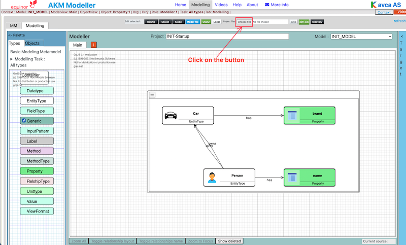
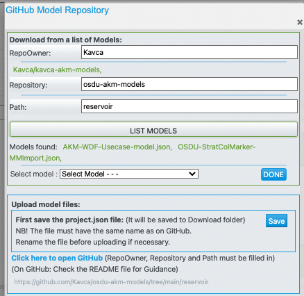

Kavca | [Upload models](UploadModels.md) | [about](about.md) | 

# osdu-akm-models

# AKM Models

This is a public repo for AKM models made in AKM Modeller and saved as .json files.

## Introduction

AKM Modelling files can be stored locally on your computer as Project.json files.  
AKM Modelling files can also be done as a collaborate task with several team members with Project.json files stored in a GitHub repository.

## Lets get started

(Tips: This page can also be viewed on : https://kavca.github.io/osdu-akm-models/)

Open the webpage:  

<https://akmclient-beta.herokuapp.com/modelling> latest version with newest features

<https://akmclient.herokuapp.com/modelling> previous more tested version

---

***(In AKM Modeller)***

Select "Modelling" in the top menu.

## Open and save local files

### 1. Open a Project.json file in AKM Modeller

Open local project files: <code> Click: "Choose file" button</code>

Click on: Project files: "Choose file" button and select the project file you want to load (.json file).

The selected file will be loaded in the AKM Modeller.

---

### 2. Then Work with your model project

See the documentation how to used AKM Modeller in "Help" in top menu.

---

### 3. Save your model project to Local Project.json file

---

To save local project files: <code> Click on: "Save" button</code>

To save the current project.json file Click on the "Save" button.

The file will by default be saved in Download folder as a "Projectname".json file.

---

### You can set up your browser to enable save to a folder

 
 <code>Browser setup:</code> 

This makes it possible to overwrite the file you have loaded (you don't have to rename the model-file every time).

<code>For Chrome:</code>

Click on the three dots in upper right corner of the browser" and select "Settings" and then "Downloads" and enable the "Ask where to save each file before downloading".

<code>For Edge:</code>

Click on the three dots in upper right corner of the browser" and select "Settings" and then "Downloads" and enable the "Ask me what to do with each download".
<code>For Safari:</code>

Safari does not have the option select folder, but will download to the "Download" folder.
Downloaded files will be deleted after one day by default.

---
---

## Open and save models on GitHub repository

To open a model stored on GitHub repository:

Open GitHub repository AKM project files in AKM Modeller: <code> Click on: "GitHub" button</code>

..

Click on "GitHub" button to open the dialog for GitHub repository and fill in the required fields.

- Repository URL:  <https://api.github.com/users/UserName/repos/>

then click on: "LIST MODELS" button and then select a model in the "Select Model" dropdown list.

(The list is from the **main** branch of the repository.)

The model will be loaded in AKM Modeller.

Click on "X" button in the top right corner to close the GitHub repository select dialog.

---

---

To upload a model to GitHub repository:

First make sure you have saved your Project.json file locally (the model you want to upload), as described in item 3 above.

[Procedure for uploading to Github repository](UploadModels.md)

