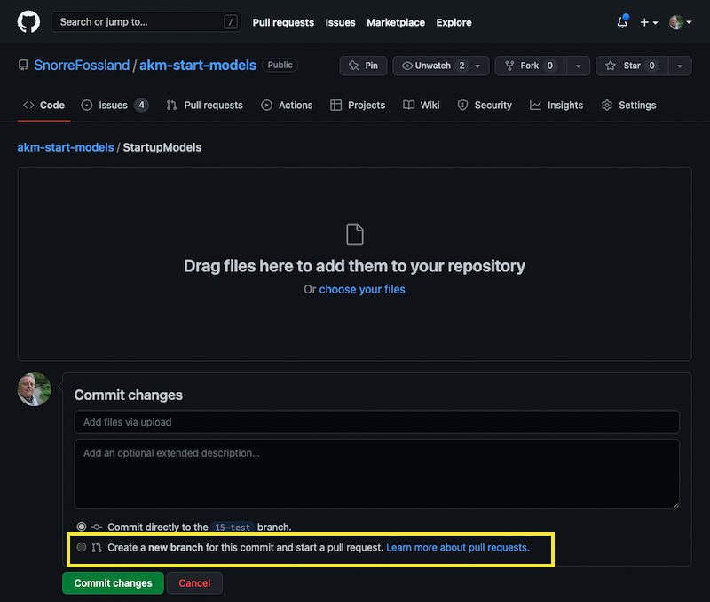
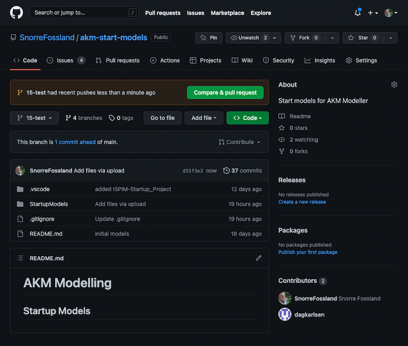
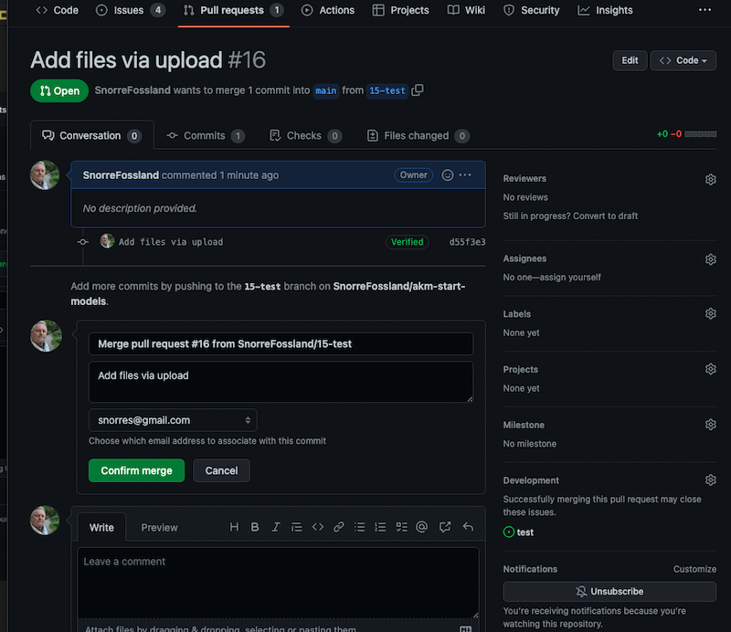
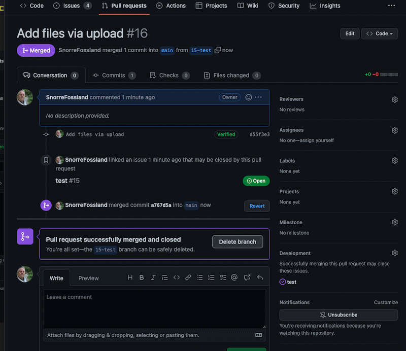

# AKM Models upload to GitHub

## Introduction

This guide will help you to upload your models to GitHub.
A AKM Project file (.json) will be uploaded to GitHub as a "text-file".

## Upload the project file to GitHub repository

***(first in AKM Modeller)***

Go to the GitHub repository <code> Find Link in "GitHub" button dialog</code> 

A link to the repository can be fond:

Click on "GitHub" button to open the dialog for GitHub repository.

Click on the "Click here to open GitHUb" link at the bottom of the dialog.

A new browserwindow opens with the repository page. 

Click on "X" button in the top right corner to close the current GitHub dialog.

---

---

***(then in GitHub repository page)***

Make sure you open the folder with the model files.

If you want to update a existing project, make sure to use the same project.json filename. (or else it will be uploaded as a new project file).

Click on the "Add file" button, and a new upload dialog opens.

---

Upload the Project file: <code> Drag or Choose file to upload, tick off "Create a new branch for this commit and start a pull request", and  then click "Commit changes" </code>

..

Drag in or "choose your files.

Select ***"Create a new branch for this commit and start a pull request"***

Then click "Commit changes" button.

---

Compare and Pull request <code> Click "Compare & pull request" button.</code>

..

Click "Compare & pull request" button.

---

Create Pull Request for the uploaded model project file <code> Click "Create pull request" button.</code>

..

(Add a comment and)Click "Create pull request" button.

---

Confirm Merge <code> Click "Confirm merge" button</code>

..

Click "Confirm merge" button.

---

The update of the project file to the main branch is completed <code> "Sucessfully Merged!" </code> 

..

The Main branch is updated with the new model project file

---

Delete you temporary branch <code> Click: "Delete branch" button</code>

..

Your branch which was created for the upload of the model project file can be deleted.

---

[Back to README.md](./README.md#AKM)
